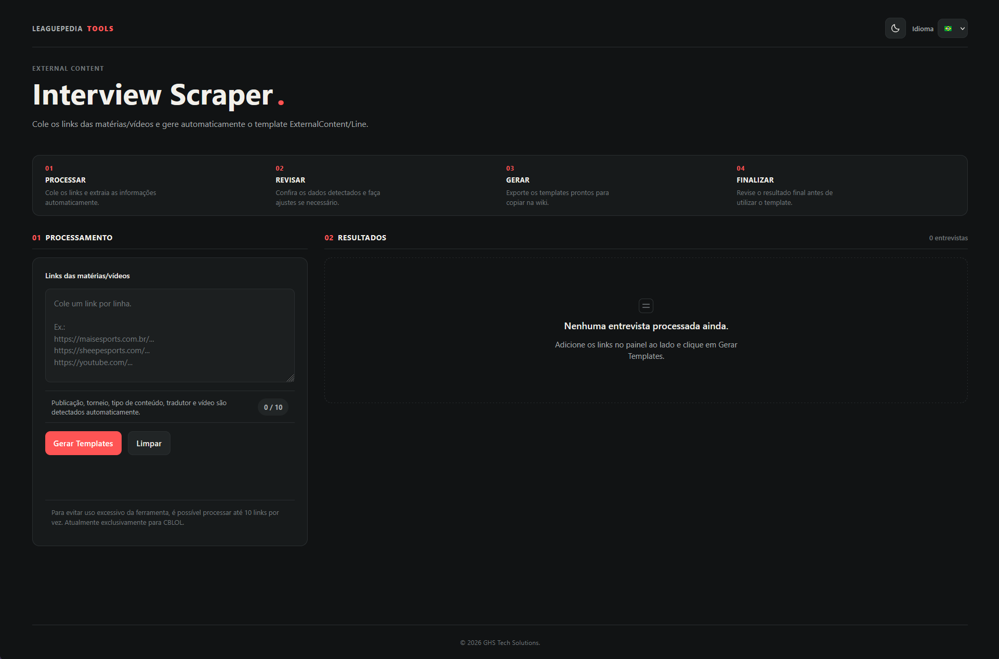

# Leaguepedia Interview Scraper

Ferramenta web para transformar links de entrevistas, matérias e vídeos em templates `{{ExternalContent/Line}}` para a [Leaguepedia](https://lol.fandom.com/wiki/League_of_Legends_Esports_Wiki), reduzindo o preenchimento manual de informações sobre conteúdos do cenário competitivo de *League of Legends*.



> **Escopo atual:** o projeto é voltado ao CBLOL. As informações são identificadas por regras e heurísticas e devem ser revisadas antes de serem publicadas na wiki.

## Como usar

1. **Processar:** cole até 10 URLs, uma por linha, e clique em **Gerar Templates**.
2. **Revisar:** confira as informações extraídas e corrija os campos quando necessário.
3. **Gerar:** obtenha os templates no formato esperado pela Leaguepedia.
4. **Finalizar:** copie o resultado revisado para a wiki.

Exemplos de links:

```text
https://maisesports.com.br/...
https://sheepesports.com/...
https://youtube.com/...
```

## Funcionalidades

- **Extração de metadados:** identifica, quando disponíveis, título, data, autor, publicação, jogadores, equipes, torneio, tradutor, tipo de conteúdo e indicador de vídeo.
- **Reconhecimento de jogadores e equipes:** cruza informações da URL e do título com uma base de nomes conhecidos.
- **Revisão manual:** permite conferir e ajustar informações antes de copiar o template.
- **Resolução de nomes ambíguos:** oferece confirmação quando uma correspondência aproximada (*fuzzy matching*) precisa de intervenção humana.
- **Aliases e memória local:** permite confirmar variações de nomes e reutilizar associações conhecidas na interface. Os dados locais do navegador não devem ser tratados como uma base compartilhada entre usuários.
- **Prevenção de processamento duplicado:** identifica URLs já processadas e solicita confirmação quando aplicável.
- **Interface multilíngue:** português brasileiro, inglês, espanhol e francês.
- **Temas:** modo escuro e modo claro.

A disponibilidade de cada campo depende da página de origem e das informações que o scraper consegue reconhecer.

## Detecções automáticas

### Publicações e formatos

O reconhecimento de publicação é direcionado principalmente a **Mais Esports** e **Sheep Esports**, com identificação a partir do domínio da URL.

Links dessas publicações são tratados prioritariamente como conteúdo escrito, enquanto links de plataformas como YouTube são identificados como vídeo. Para outros domínios, o sistema pode recorrer aos elementos e metadados da página. Essa distinção ajuda a evitar que vídeos incorporados em matérias alterem incorretamente o tipo do conteúdo principal.

### Torneios

O sistema tenta identificar torneios usando informações da URL, do título, do conteúdo e da data. O foco atual inclui:

- CBLOL Cup
- CBLOL Split 1
- CBLOL Split 2

### Jogadores, equipes e aliases

A identificação parte de uma base interna de jogadores e equipes. Nomes encontrados nas matérias podem ser comparados com registros conhecidos, incluindo variações de nickname. Quando uma associação não é suficientemente clara, o fluxo de revisão permite confirmar ou corrigir o resultado.

**Importante:** reconhecimento automático e correspondência aproximada não garantem identidade correta. Casos de nomes iguais, mudanças de equipe e múltiplos entrevistados exigem atenção editorial.

## Template gerado

O formato de saída é o template `ExternalContent/Line`, por exemplo:

```wikitext
{{ExternalContent/Line
|url=...
|title=...
|players=...
|teams=...
|tournament=...
|publication=...
|author=...
|translator=...
|type=...
|isvideo=...
}}
```

Os campos são preenchidos conforme as informações detectadas e revisadas. O exemplo acima é ilustrativo.

## Arquitetura

O frontend estático é publicado no **GitHub Pages** e se comunica com uma API **Flask**, que pode ser hospedada no **Render**. O backend utiliza **Requests** e **BeautifulSoup** para obter e interpretar informações das páginas de origem.

```text
Navegador
  └── Frontend (HTML, CSS, JavaScript) — GitHub Pages
        └── API Flask — Render
              └── Requests + BeautifulSoup
                    └── Página de origem
              └── Dados extraídos
        └── Revisão e geração do template
```

### Tecnologias

| Camada | Tecnologias |
| --- | --- |
| Frontend | HTML, CSS, JavaScript |
| Backend | Python, Flask, Requests, BeautifulSoup, Gunicorn |
| Hospedagem | GitHub Pages (frontend), Render (backend) |

## Estrutura do projeto

```text
interviewscrapper-leaguepedia/
├── .github/
│   └── workflows/
│       └── deploy-pages.yml
├── backend/
│   ├── app.py
│   └── requirements.txt
├── frontend/
│   ├── index.html
│   ├── app.js
│   ├── style.css
│   └── favicon.svg
├── assets/
│   └── interface.png
├── README.md
└── render.yaml
```

A pasta `assets/` é usada apenas para as imagens da documentação. A estrutura acima destaca os principais arquivos, não necessariamente todos os arquivos auxiliares do repositório.

## Executar localmente

### Backend

Requer **Python 3.10 ou superior**.

```bash
cd backend
python -m venv .venv
```

Ative o ambiente virtual:

**Windows (PowerShell):**

```powershell
.venv\Scripts\Activate.ps1
```

**Windows (Prompt de Comando):**

```bat
.venv\Scripts\activate.bat
```

**Linux/macOS:**

```bash
source .venv/bin/activate
```

Instale as dependências e inicie a API:

```bash
pip install -r requirements.txt
python app.py
```

Endereço local esperado: `http://localhost:5000`.

Para conferir a disponibilidade da API, acesse `http://localhost:5000/api/health`.

### Frontend

Os arquivos estão em `frontend/`. Para testar a interface localmente, abra `index.html` no navegador ou sirva a pasta por um servidor estático. **A configuração da URL da API no `app.js` deve apontar para o backend que será utilizado no teste**; abrir o HTML sozinho não garante que o processamento de URLs funcione.

## Deploy

### GitHub Pages

O workflow `.github/workflows/deploy-pages.yml` publica os arquivos selecionados de `frontend/`, incluindo o favicon. Como a cópia para `_site/` é explícita, novos arquivos estáticos precisam ser adicionados ao workflow para aparecerem no site publicado.

### Render

O backend pode ser hospedado no Render, com deploys vinculados ao repositório conforme a configuração do serviço. O endereço da API utilizado pela interface é definido no frontend.

## Limitações e revisão editorial

A ferramenta não substitui a verificação humana. É especialmente importante revisar resultados quando houver:

- jogadores ausentes da base interna ou nicknames semelhantes;
- múltiplos entrevistados ou equipes citadas na mesma matéria;
- mudanças recentes de equipe;
- publicações e redes sociais fora dos domínios prioritários;
- matérias fora do período esperado de um torneio;
- conteúdo misto, com texto e vídeo incorporado;
- páginas inacessíveis, modificadas ou com metadados incompletos.

A memória local de aliases também pode variar entre navegadores e dispositivos. Não há garantia de sincronização entre usuários.

## Possíveis evoluções

Estas são **ideias de desenvolvimento**, não funcionalidades anunciadas como concluídas:

- ampliar o reconhecimento para outras publicações e competições;
- aprimorar a identificação de jogadores e equipes em situações ambíguas;
- ampliar os recursos de memória e revisão de metadados;
- adicionar testes automatizados para diferentes formatos de publicação.

## Objetivo

Reduzir o trabalho repetitivo na catalogação de entrevistas e conteúdos externos da Leaguepedia, preservando a revisão editorial antes da publicação.
